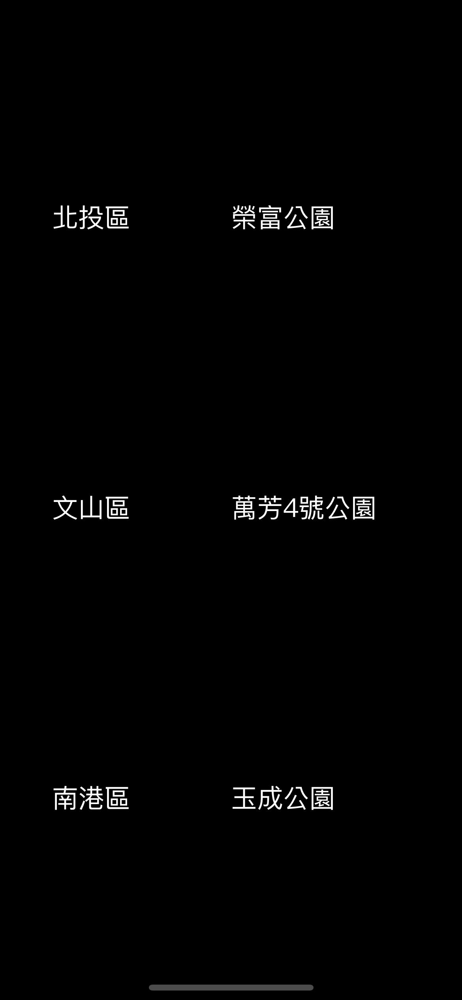

# DI Part 3 - GCD

### Before Assignment

下列為臺北市 [Open API](https://data.taipei/#/) 所提供之[共融式遊戲場資訊](https://data.taipei/api/v1/dataset/c7784a9f-e11e-4145-8b72-95b44fdc7b83) API 格式：

* **URL:** https://data.taipei/api/v1/dataset/c7784a9f-e11e-4145-8b72-95b44fdc7b83s

* **Method:** `GET`

* **Header Params:** None

* **Query String**

| Field | Value |
| :---: | :---: |
| scope | resourceAquire |
| limit | Depends. 代表筆數上限(1000)|
| offset |  Depends. 代表位移筆數|

* **Request Example:**

```
https://data.taipei/api/v1/dataset/c7784a9f-e11e-4145-8b72-95b44fdc7b83?scope=resourceAquire&limit=1&offset=0
```

* **Success Response: 200**

```
{
    "result": {
        "limit": 1,
        "offset": 0,
        "count": 83,
        "sort": "",
        "results": [
            {
                "_id": 1,
                "location": "榮富公園",
                "district": "北投區",
                "address": "臺北市北投區榮華三路與磺溪旁",
                "longitude": "121.5247",
                "latitude": "25.11433"
            }
        ]
    }
}
```

### Assignment

1. 設計一個 App，畫面上有 6 個 UILabel，位置沒有限制。
2. 請利用上述 API，分別拿取 offset 為 0, 10, 20 的共融式遊戲場資料，Limit 都設定為 1 即可。
3. 每兩個 UILabel 為一組，分別顯示 Response 中，"district" 與 "location" 的資料。
4. 將步驟 2 的三個 Request 所拿到的 Response
- 利用 GCD Group 的特性，將三個 Response 的資料，`同時` 呈現在畫面上。
- 利用 GCD Semaphore 的特性，將三個 Response 的資料，依照 offset 的順序，`依序` 呈現在畫面上。

<video src="images/GCD_01.mp4" controls muted width=45%></video>
<video src="images/GCD_02.mp4" controls muted width=45%></video>
<!--  -->